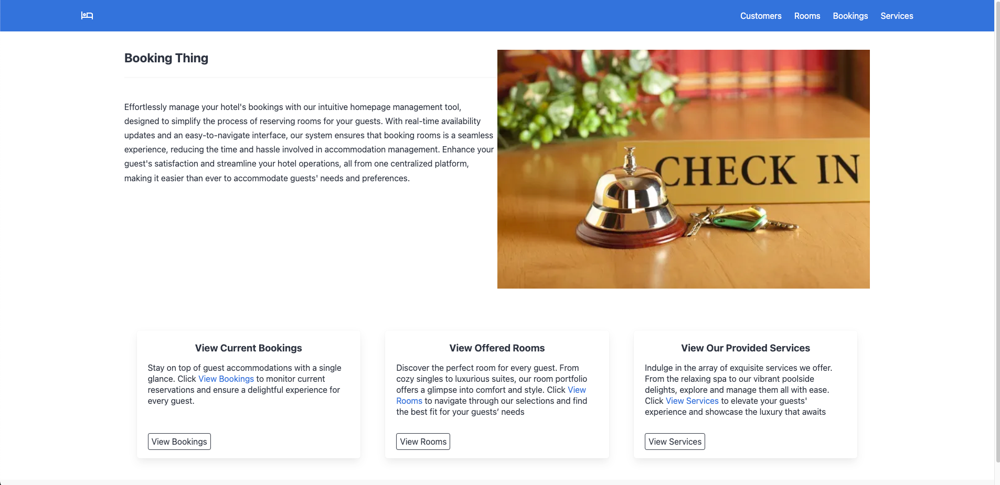

# Booking Thing
Final project for CSCI3240U, Web Application Development

Effortlessly manage your hotel's bookings with our intuitive homepage management tool, designed to simplify the process of reserving rooms for your guests. With real-time availability updates and an easy-to-navigate interface, our system ensures that booking rooms is a seamless experience, reducing the time and hassle involved in accommodation management. Enhance your guest's satisfaction and streamline your hotel operations, all from one centralized platform, making it easier than ever to accommodate guests' needs and preferences.

## Building the project 
1. Ensure you have [H2db](https://www.h2database.com/html/download.html) and [Java 17+](https://www.java.com/en/download/) installed
2. update _src/resources/application.properties_
   - `spring.datasource.url = jdbc:h2:<path to your H2db>;AUTO_SERVER=true`
   - `spring.datasource.username=<your h2db username>`
   - `spring.datasource.password=<your h2db password>`
3. Install the dependencies by clicking the maven refresh button
in the top right of Intellij Idea, or by right clicking __pom.xml__ and under Maven select "__Reload Project__"
4. To run the project, run Main (_src/java/com.webdev.project/Main.java_). navigating to `http://localhost` in 
your web browser of choice should display the _index.html_ page below. (might need to add port if not set to 80 in _application.properties_ file)
 
 